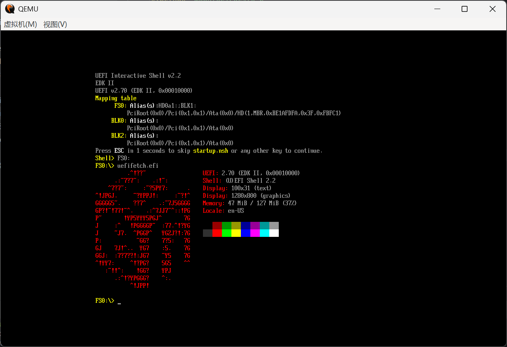

English [简体中文](README.zh-CN.md)

# UEFI fetch

like any fetch for any platform, but for UEFI

## Why?

Why not?

## Features

### Platforms

- UEFI x86_64

### Modules

- Logo
- UEFI
- Shell
- Display
- Memory
- Locale
- Placeholder
- IP4

## Usage

call from UEFI shell, chainload by bootloader, direct boot from file, ..., anyway you want

some motherboard have a buggy UEFI implementation, causing CPU freezing

try remove some uefifetch modules

## Gallery

## TODO

- more modules
  - Battery
  - CPU
  - Disk
  - Network
  - Version
  - BGRT
  - BIOS
  - ...
- command line options
- custom logo
- use BGRT as logo

## Also see

- [UEFI](https://uefi.org/)
- [EDK II](https://github.com/tianocore/edk2)
- [Index of “Step to UEFI” (zh-CN)](https://www.lab-z.com/iof/)
- [从零开始的UEFI裸机编程 (zh-CN)](https://kagurazakakotori.github.io/ubmp-cn/index.html)
- [フルスクラッチで作る!UEFIベアメタルプログラミング (ja)](http://yuma.ohgami.jp/UEFI-Bare-Metal-Programming/index.html)
- [yaroslav957/efifetch](https://github.com/yaroslav957/efifetch)