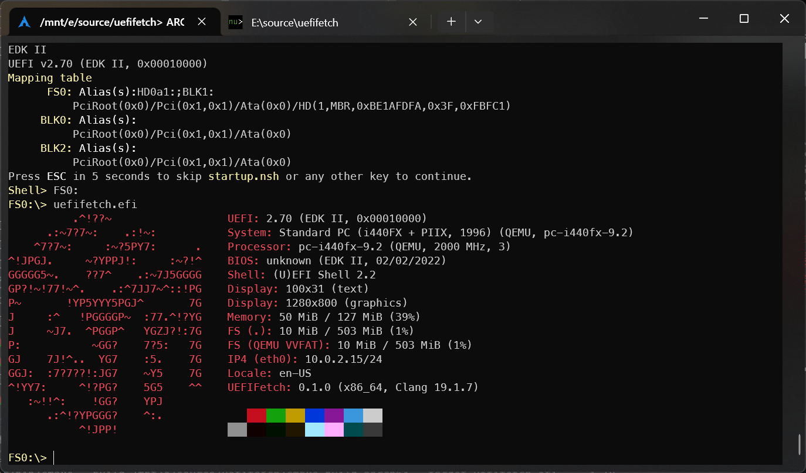

[English](README.md) 简体中文

# UEFIFetch

就像任何平台的任何 fetch，但是 UEFI

## 为什么?

为什么不呢?


## 特性

### 平台

- UEFI x86_64
- UEFI aarch64

### 模块

- Logo
- UEFI
- Shell
- Display
- Memory
- Locale
- Placeholder
- IP4
- FS
- FS2
- SMBIOS
- UefiFetch

## 构建

依赖 [uefi-libc](https://github.com/duzhaokun123/uefi-libc) 但任何其他 uefi libc 应该也可以工作 (需要将 ST BS RS LIP 导出到全局变量)

构建和安装 uefi-libc 后

```bash
cmake -S . -B build \
    --toolchain /path/to/<arch>-uefi-clang.cmake
cmake --build build
```

## 用法

从 UEFI shell 调用, 使用 bootloader 链式引导, 直接从文件启动, ..., 或者你能想到任何方式

一些主板带有有 bug 的 UEFI 实现, 导致 CPU 锁死

尝试移除一些 uefifetch 模块

## 截图

|                           |                           |
|:-------------------------:|:-------------------------:|
|  |  |

## TODO

- 更多模块
  - Battery
  - CPU
  - Disk
  - Network
  - BGRT
  - ...
- 自定义 logo
- BGRT 作为 logo

## 也看看

- [UEFI](https://uefi.org/)
- [SMBIOS](https://www.dmtf.org/standards/smbios)
- [OSDev.org](https://wiki.osdev.org/)
- [Index of “Step to UEFI”](https://www.lab-z.com/iof/)
- [从零开始的UEFI裸机编程](https://kagurazakakotori.github.io/ubmp-cn/index.html)
- [フルスクラッチで作る!UEFIベアメタルプログラミング (日文)](http://yuma.ohgami.jp/UEFI-Bare-Metal-Programming/index.html)
- [yaroslav957/efifetch](https://github.com/yaroslav957/efifetch)